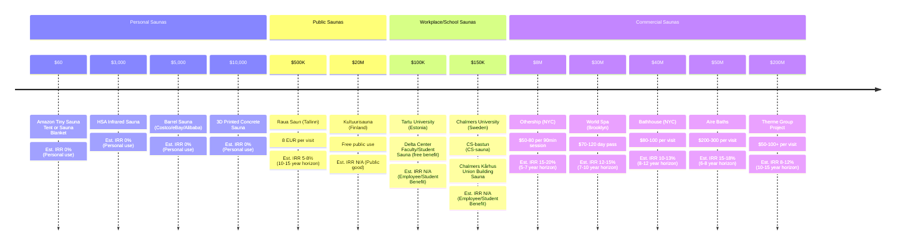

  <h1>Wanna Sauna?</h1>
  <h2>Saunas are inaccessible. Here's how to get one for your home, workplace, and city :)</h2>
  <a href="https://saunalist.org">saunalist.org has global sauna listings too!↗︎</a>

Saunas have financial returns and non-financial returns.

The non-financial returns of saunas include:

* social connection risk score reduction (c.f. reviews on the public health risks of [loneliness](https://www.ncbi.nlm.nih.gov/pmc/articles/PMC5598785/))
* health benefits, such as reduced all-cause mortality (c.f. many articles such as [this one](https://www.ncbi.nlm.nih.gov/pmc/articles/PMC6262976/) describing research in cultures in which saunas are common, such as Finland)

Edit the following diagram [here](https://www.mermaidchart.com/app/projects/3eff3399-79fc-46e3-a424-3e78655e6142/diagrams/2168f791-4b5b-4eec-9f86-ca194dee46b7/version/v0.1/edit) if you have any suggestions, or Tweet/DM me on Twitter at [@thejaan](https://x.com/thejaan)!

